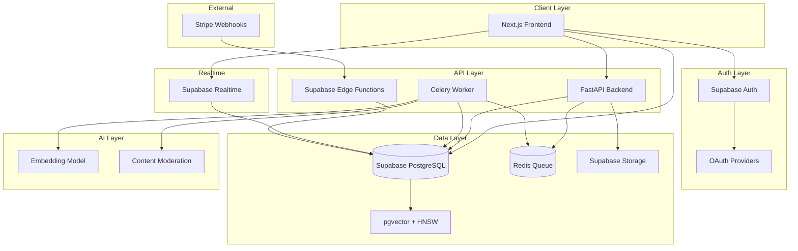

# Supabase 기반 노래방 커뮤니티 DB 설계 (v3 - Final)

## 개요

**글로벌 다국어 노래방 공유 커뮤니티**를 위한 Supabase 기반 데이터베이스 설계입니다.

### v3 핵심 변경사항 (Final)

- **HNSW 인덱스**: ivfflat에서 더 빠르고 정확한 hnsw로 업그레이드
- **Storage Path 전략**: URL 직접 저장 대신 storage_path + Signed URL 생성
- **환불 추적**: credit_transactions에 parent_transaction_id로 환불 연결
- **notifications 테이블**: 좋아요, 댓글, 작업 완료 등 알림 시스템
- **시맨틱 검색**: Embedding 기반 다국어 의미 검색

## 아키텍처



## ERD (완전판 v3)

```mermaid
erDiagram
    profiles ||--o{ jobs : creates
    profiles ||--o{ posts : shares
    profiles ||--o{ comments : writes
    profiles ||--o{ likes : gives
    profiles ||--o{ api_keys : owns
    profiles ||--o| subscriptions : has
    profiles ||--o{ credit_transactions : has
    profiles ||--o{ notifications : receives

    jobs ||--o| posts : "published as"
    posts ||--o{ video_variants : has
    posts ||--o{ comments : has
    posts ||--o{ likes : receives

    credit_transactions ||--o| credit_transactions : "refund of"

    subscriptions }o--|| plans : references

    profiles {
        uuid id PK
        text email UK
        text username UK
        text display_name
        text avatar_url
        text locale
        text timezone
        integer credits_balance
        text stripe_customer_id
        boolean is_active
        timestamptz created_at
        timestamptz updated_at
    }

    jobs {
        uuid id PK
        uuid user_id FK
        text title
        text artist
        platform_type platform
        text source_language
        text[] target_languages
        text template
        boolean is_external_media
        text storage_path
        job_status status
        integer progress
        text detail
        jsonb result_meta
        text error
        text ai_model_version
        integer credit_cost
        vector_1536 embedding
        timestamptz created_at
        timestamptz completed_at
    }

    posts {
        uuid id PK
        uuid user_id FK
        uuid job_id FK UK
        text title
        text description
        text thumbnail_path
        text[] tags
        integer view_count
        integer like_count
        integer comment_count
        boolean is_featured
        moderation_status moderation
        text moderation_note
        vector_1536 embedding
        timestamptz created_at
        timestamptz updated_at
    }

    video_variants {
        uuid id PK
        uuid post_id FK
        text language_code
        text storage_path
        text subtitle_path
        integer duration_seconds
        jsonb metadata
        timestamptz created_at
    }

    comments {
        uuid id PK
        uuid post_id FK
        uuid user_id FK
        uuid parent_id FK
        text content
        integer like_count
        timestamptz created_at
        timestamptz updated_at
    }

    likes {
        uuid id PK
        uuid user_id FK
        uuid post_id FK
        uuid comment_id FK
        timestamptz created_at
    }

    notifications {
        uuid id PK
        uuid user_id FK
        uuid actor_id FK
        notification_type type
        uuid target_id
        text target_type
        jsonb data
        timestamptz read_at
        timestamptz created_at
    }

    plans {
        uuid id PK
        text name UK
        integer credits_per_month
        integer price_cents
        jsonb features
        text[] allowed_templates
        boolean is_active
        timestamptz created_at
    }

    subscriptions {
        uuid id PK
        uuid user_id FK UK
        uuid plan_id FK
        subscription_status status
        text stripe_subscription_id
        text stripe_customer_id
        timestamptz current_period_start
        timestamptz current_period_end
        timestamptz created_at
        timestamptz updated_at
    }

    credit_transactions {
        uuid id PK
        uuid user_id FK
        uuid parent_transaction_id FK
        integer amount
        integer balance_after
        credit_tx_type type
        uuid reference_id
        text description
        timestamptz created_at
    }

    api_keys {
        uuid id PK
        uuid user_id FK
        text name
        text key_hash UK
        text key_prefix
        text[] scopes
        timestamptz last_used_at
        timestamptz expires_at
        boolean is_active
        timestamptz created_at
    }
```

## PostgreSQL 확장 활성화

```sql
-- pgvector: AI 임베딩 벡터 저장 및 유사도 검색
CREATE EXTENSION IF NOT EXISTS vector;

-- pg_trgm: 텍스트 유사도 검색 (fallback)
CREATE EXTENSION IF NOT EXISTS pg_trgm;
```

## ENUM 타입 정의

```sql
-- 작업 상태
CREATE TYPE job_status AS ENUM (
  'pending',
  'queued',
  'downloading',
  'separating',
  'transcribing',
  'translating',
  'rendering',
  'uploading',
  'completed',
  'failed'
);

-- 플랫폼 타입
CREATE TYPE platform_type AS ENUM (
  'youtube',
  'tiktok',
  'shorts',
  'instagram'
);

-- 구독 상태
CREATE TYPE subscription_status AS ENUM (
  'active',
  'canceled',
  'past_due',
  'trialing',
  'paused'
);

-- 크레딧 거래 유형
CREATE TYPE credit_tx_type AS ENUM (
  'subscription_grant',
  'purchase',
  'job_usage',
  'refund',
  'bonus'
);

-- 콘텐츠 모더레이션 상태
CREATE TYPE moderation_status AS ENUM (
  'pending',
  'approved',
  'rejected',
  'flagged'
);

-- 알림 유형 (신규)
CREATE TYPE notification_type AS ENUM (
  'like',           -- 누군가 내 포스트에 좋아요
  'comment',        -- 누군가 내 포스트에 댓글
  'reply',          -- 누군가 내 댓글에 답글
  'mention',        -- 누군가 나를 멘션
  'job_completed',  -- 작업 완료
  'job_failed',     -- 작업 실패
  'follow',         -- 누군가 나를 팔로우 (향후)
  'system'          -- 시스템 알림
);
```

## 테이블 상세 설계

### 1. profiles 테이블

```sql
CREATE TABLE profiles (
  id UUID PRIMARY KEY REFERENCES auth.users(id) ON DELETE CASCADE,
  email TEXT UNIQUE NOT NULL,
  username TEXT UNIQUE,
  display_name TEXT,
  avatar_url TEXT,
  locale TEXT DEFAULT 'en',
  timezone TEXT DEFAULT 'UTC',
  credits_balance INTEGER DEFAULT 0 CHECK (credits_balance >= 0),
  stripe_customer_id TEXT,
  is_active BOOLEAN DEFAULT TRUE,
  created_at TIMESTAMPTZ DEFAULT NOW(),
  updated_at TIMESTAMPTZ DEFAULT NOW()
);

-- Auth 유저 생성 시 자동으로 profile 생성
CREATE OR REPLACE FUNCTION handle_new_user()
RETURNS TRIGGER AS $$
BEGIN
  INSERT INTO public.profiles (id, email, display_name, avatar_url, credits_balance)
  VALUES (
    NEW.id,
    NEW.email,
    COALESCE(NEW.raw_user_meta_data->>'full_name', NEW.raw_user_meta_data->>'name'),
    NEW.raw_user_meta_data->>'avatar_url',
    50  -- 신규 가입 보너스 크레딧
  );
  RETURN NEW;
END;
$$ LANGUAGE plpgsql SECURITY DEFINER;

CREATE TRIGGER on_auth_user_created
  AFTER INSERT ON auth.users
  FOR EACH ROW EXECUTE FUNCTION handle_new_user();
```

### 2. jobs 테이블

```sql
CREATE TABLE jobs (
  id UUID PRIMARY KEY DEFAULT gen_random_uuid(),
  user_id UUID NOT NULL REFERENCES profiles(id) ON DELETE CASCADE,
  title TEXT NOT NULL,
  artist TEXT NOT NULL,
  platform platform_type NOT NULL,
  source_language TEXT NOT NULL,
  target_languages TEXT[] NOT NULL,
  template TEXT NOT NULL,
  is_external_media BOOLEAN DEFAULT FALSE,
  storage_path TEXT,                          -- Supabase Storage 경로만 저장
  status job_status DEFAULT 'pending',
  progress INTEGER DEFAULT 0 CHECK (progress >= 0 AND progress <= 100),
  detail TEXT,
  result_meta JSONB,
  error TEXT,
  ai_model_version TEXT,
  credit_cost INTEGER DEFAULT 0,
  embedding vector(1536),
  created_at TIMESTAMPTZ DEFAULT NOW(),
  completed_at TIMESTAMPTZ
);

-- 인덱스
CREATE INDEX idx_jobs_user_created ON jobs(user_id, created_at DESC);
CREATE INDEX idx_jobs_status ON jobs(status) WHERE status NOT IN ('completed', 'failed');
-- HNSW: 더 빠르고 정확한 벡터 검색 (ivfflat 대신)
CREATE INDEX idx_jobs_embedding ON jobs USING hnsw (embedding vector_cosine_ops);
```

### 3. posts 테이블

```sql
CREATE TABLE posts (
  id UUID PRIMARY KEY DEFAULT gen_random_uuid(),
  user_id UUID NOT NULL REFERENCES profiles(id) ON DELETE CASCADE,
  job_id UUID UNIQUE REFERENCES jobs(id) ON DELETE SET NULL,
  title TEXT NOT NULL,
  description TEXT,
  thumbnail_path TEXT,                        -- storage_path만 저장 (URL 아님)
  tags TEXT[] DEFAULT '{}',
  view_count INTEGER DEFAULT 0,
  like_count INTEGER DEFAULT 0,
  comment_count INTEGER DEFAULT 0,
  is_featured BOOLEAN DEFAULT FALSE,
  moderation_status moderation_status DEFAULT 'pending',
  moderation_note TEXT,
  embedding vector(1536),
  created_at TIMESTAMPTZ DEFAULT NOW(),
  updated_at TIMESTAMPTZ DEFAULT NOW()
);

-- 인덱스
CREATE INDEX idx_posts_user ON posts(user_id);
CREATE INDEX idx_posts_created ON posts(created_at DESC);
CREATE INDEX idx_posts_popular ON posts(like_count DESC, created_at DESC);
CREATE INDEX idx_posts_tags ON posts USING GIN(tags);
CREATE INDEX idx_posts_moderation ON posts(moderation_status) WHERE moderation_status = 'pending';
-- HNSW 벡터 인덱스
CREATE INDEX idx_posts_embedding ON posts USING hnsw (embedding vector_cosine_ops);
CREATE INDEX idx_posts_title_trgm ON posts USING GIN (title gin_trgm_ops);
```

### 4. video_variants 테이블 (URL 대신 storage_path만)

```sql
CREATE TABLE video_variants (
  id UUID PRIMARY KEY DEFAULT gen_random_uuid(),
  post_id UUID NOT NULL REFERENCES posts(id) ON DELETE CASCADE,
  language_code TEXT NOT NULL,
  storage_path TEXT NOT NULL,                 -- Storage 경로만 저장!
  subtitle_path TEXT,                         -- 자막 파일 경로
  duration_seconds INTEGER,
  metadata JSONB DEFAULT '{}',
  created_at TIMESTAMPTZ DEFAULT NOW(),

  UNIQUE(post_id, language_code)
);

CREATE INDEX idx_variants_post ON video_variants(post_id);
CREATE INDEX idx_variants_language ON video_variants(language_code);
```

### 5. comments 테이블

```sql
CREATE TABLE comments (
  id UUID PRIMARY KEY DEFAULT gen_random_uuid(),
  post_id UUID NOT NULL REFERENCES posts(id) ON DELETE CASCADE,
  user_id UUID NOT NULL REFERENCES profiles(id) ON DELETE CASCADE,
  parent_id UUID REFERENCES comments(id) ON DELETE CASCADE,
  content TEXT NOT NULL CHECK (char_length(content) <= 2000),
  like_count INTEGER DEFAULT 0,
  created_at TIMESTAMPTZ DEFAULT NOW(),
  updated_at TIMESTAMPTZ DEFAULT NOW()
);

CREATE INDEX idx_comments_post ON comments(post_id, created_at);
CREATE INDEX idx_comments_parent ON comments(parent_id) WHERE parent_id IS NOT NULL;
```

### 6. likes 테이블

```sql
CREATE TABLE likes (
  id UUID PRIMARY KEY DEFAULT gen_random_uuid(),
  user_id UUID NOT NULL REFERENCES profiles(id) ON DELETE CASCADE,
  post_id UUID REFERENCES posts(id) ON DELETE CASCADE,
  comment_id UUID REFERENCES comments(id) ON DELETE CASCADE,
  created_at TIMESTAMPTZ DEFAULT NOW(),

  CONSTRAINT like_target_check CHECK (
    (post_id IS NOT NULL AND comment_id IS NULL) OR
    (post_id IS NULL AND comment_id IS NOT NULL)
  ),
  CONSTRAINT unique_post_like UNIQUE (user_id, post_id),
  CONSTRAINT unique_comment_like UNIQUE (user_id, comment_id)
);
```

### 7. notifications 테이블 (신규)

```sql
CREATE TABLE notifications (
  id UUID PRIMARY KEY DEFAULT gen_random_uuid(),
  user_id UUID NOT NULL REFERENCES profiles(id) ON DELETE CASCADE,   -- 알림 받는 사람
  actor_id UUID REFERENCES profiles(id) ON DELETE SET NULL,          -- 행위자 (시스템 알림은 NULL)
  type notification_type NOT NULL,
  target_id UUID,                             -- 대상 ID (post_id, comment_id, job_id 등)
  target_type TEXT,                           -- 'post', 'comment', 'job' 등
  data JSONB DEFAULT '{}',                    -- 추가 데이터 (포스트 제목 등)
  read_at TIMESTAMPTZ,                        -- NULL이면 안 읽음
  created_at TIMESTAMPTZ DEFAULT NOW()
);

CREATE INDEX idx_notifications_user ON notifications(user_id, created_at DESC);
CREATE INDEX idx_notifications_unread ON notifications(user_id, read_at) WHERE read_at IS NULL;
```

**알림 생성 트리거 (좋아요 예시):**

```sql
CREATE OR REPLACE FUNCTION notify_on_like()
RETURNS TRIGGER AS $$
DECLARE
  v_post_owner_id UUID;
  v_post_title TEXT;
BEGIN
  -- 포스트 좋아요일 때만
  IF NEW.post_id IS NOT NULL THEN
    SELECT user_id, title INTO v_post_owner_id, v_post_title
    FROM posts WHERE id = NEW.post_id;

    -- 본인 좋아요는 알림 안 함
    IF v_post_owner_id != NEW.user_id THEN
      INSERT INTO notifications (user_id, actor_id, type, target_id, target_type, data)
      VALUES (
        v_post_owner_id,
        NEW.user_id,
        'like',
        NEW.post_id,
        'post',
        jsonb_build_object('post_title', v_post_title)
      );
    END IF;
  END IF;

  RETURN NEW;
END;
$$ LANGUAGE plpgsql;

CREATE TRIGGER on_like_created
  AFTER INSERT ON likes
  FOR EACH ROW EXECUTE FUNCTION notify_on_like();
```

### 8. plans 테이블

```sql
CREATE TABLE plans (
  id UUID PRIMARY KEY DEFAULT gen_random_uuid(),
  name TEXT UNIQUE NOT NULL,
  credits_per_month INTEGER NOT NULL,
  price_cents INTEGER NOT NULL,
  features JSONB DEFAULT '{}',
  allowed_templates TEXT[] DEFAULT '{}',
  is_active BOOLEAN DEFAULT TRUE,
  created_at TIMESTAMPTZ DEFAULT NOW()
);

INSERT INTO plans (name, credits_per_month, price_cents, features, allowed_templates) VALUES
  ('free', 50, 0,
   '{"max_video_length_seconds": 180, "watermark": true, "max_languages": 1}',
   '{"basic", "simple"}'),
  ('pro', 500, 990,
   '{"max_video_length_seconds": 600, "watermark": false, "priority_queue": true, "max_languages": 3}',
   '{"basic", "simple", "premium", "animated"}'),
  ('enterprise', 5000, 4990,
   '{"max_video_length_seconds": 1800, "watermark": false, "priority_queue": true, "api_access": true, "max_languages": 10}',
   '{"basic", "simple", "premium", "animated", "custom"}');
```

### 9. subscriptions 테이블

```sql
CREATE TABLE subscriptions (
  id UUID PRIMARY KEY DEFAULT gen_random_uuid(),
  user_id UUID UNIQUE NOT NULL REFERENCES profiles(id) ON DELETE CASCADE,
  plan_id UUID NOT NULL REFERENCES plans(id),
  status subscription_status DEFAULT 'active',
  stripe_subscription_id TEXT,
  stripe_customer_id TEXT,
  current_period_start TIMESTAMPTZ,
  current_period_end TIMESTAMPTZ,
  created_at TIMESTAMPTZ DEFAULT NOW(),
  updated_at TIMESTAMPTZ DEFAULT NOW()
);
```

### 10. credit_transactions 테이블 (환불 추적 추가)

```sql
CREATE TABLE credit_transactions (
  id UUID PRIMARY KEY DEFAULT gen_random_uuid(),
  user_id UUID NOT NULL REFERENCES profiles(id) ON DELETE CASCADE,
  parent_transaction_id UUID REFERENCES credit_transactions(id),  -- 환불 시 원본 거래 연결
  amount INTEGER NOT NULL,
  balance_after INTEGER NOT NULL,
  type credit_tx_type NOT NULL,
  reference_id UUID,                          -- job_id, subscription_id 등
  description TEXT,
  created_at TIMESTAMPTZ DEFAULT NOW()
);

CREATE INDEX idx_credit_tx_user ON credit_transactions(user_id, created_at DESC);
CREATE INDEX idx_credit_tx_reference ON credit_transactions(reference_id) WHERE reference_id IS NOT NULL;
CREATE INDEX idx_credit_tx_parent ON credit_transactions(parent_transaction_id) WHERE parent_transaction_id IS NOT NULL;
```

### 11. api_keys 테이블

```sql
CREATE TABLE api_keys (
  id UUID PRIMARY KEY DEFAULT gen_random_uuid(),
  user_id UUID NOT NULL REFERENCES profiles(id) ON DELETE CASCADE,
  name TEXT NOT NULL,
  key_hash TEXT UNIQUE NOT NULL,
  key_prefix TEXT NOT NULL,
  scopes TEXT[] DEFAULT '{"jobs:read", "jobs:write"}',
  last_used_at TIMESTAMPTZ,
  expires_at TIMESTAMPTZ,
  is_active BOOLEAN DEFAULT TRUE,
  created_at TIMESTAMPTZ DEFAULT NOW()
);

CREATE INDEX idx_api_keys_hash ON api_keys(key_hash) WHERE is_active = TRUE;
```

## 크레딧 시스템 함수

### 크레딧 차감 (원자적)

```sql
CREATE OR REPLACE FUNCTION deduct_credits(
  p_user_id UUID,
  p_amount INTEGER,
  p_reference_id UUID DEFAULT NULL,
  p_description TEXT DEFAULT NULL
) RETURNS INTEGER AS $$
DECLARE
  v_new_balance INTEGER;
BEGIN
  UPDATE profiles
  SET credits_balance = credits_balance - p_amount, updated_at = NOW()
  WHERE id = p_user_id AND credits_balance >= p_amount
  RETURNING credits_balance INTO v_new_balance;

  IF v_new_balance IS NOT NULL THEN
    INSERT INTO credit_transactions (user_id, amount, balance_after, type, reference_id, description)
    VALUES (p_user_id, -p_amount, v_new_balance, 'job_usage', p_reference_id, p_description);
  END IF;

  RETURN v_new_balance;
END;
$$ LANGUAGE plpgsql;
```

### 크레딧 충전

```sql
CREATE OR REPLACE FUNCTION add_credits(
  p_user_id UUID,
  p_amount INTEGER,
  p_type credit_tx_type,
  p_reference_id UUID DEFAULT NULL,
  p_description TEXT DEFAULT NULL
) RETURNS INTEGER AS $$
DECLARE
  v_new_balance INTEGER;
BEGIN
  UPDATE profiles
  SET credits_balance = credits_balance + p_amount, updated_at = NOW()
  WHERE id = p_user_id
  RETURNING credits_balance INTO v_new_balance;

  INSERT INTO credit_transactions (user_id, amount, balance_after, type, reference_id, description)
  VALUES (p_user_id, p_amount, v_new_balance, p_type, p_reference_id, p_description);

  RETURN v_new_balance;
END;
$$ LANGUAGE plpgsql;
```

### 크레딧 환불 (원본 거래 연결)

```sql
CREATE OR REPLACE FUNCTION refund_credits(
  p_original_transaction_id UUID,
  p_description TEXT DEFAULT '작업 실패로 인한 환불'
) RETURNS INTEGER AS $$
DECLARE
  v_user_id UUID;
  v_original_amount INTEGER;
  v_new_balance INTEGER;
BEGIN
  -- 원본 거래 정보 조회
  SELECT user_id, ABS(amount)
  INTO v_user_id, v_original_amount
  FROM credit_transactions
  WHERE id = p_original_transaction_id AND type = 'job_usage';

  IF v_user_id IS NULL THEN
    RAISE EXCEPTION 'Original transaction not found';
  END IF;

  -- 잔액 복구
  UPDATE profiles
  SET credits_balance = credits_balance + v_original_amount, updated_at = NOW()
  WHERE id = v_user_id
  RETURNING credits_balance INTO v_new_balance;

  -- 환불 기록 (parent_transaction_id로 연결)
  INSERT INTO credit_transactions (user_id, parent_transaction_id, amount, balance_after, type, description)
  VALUES (v_user_id, p_original_transaction_id, v_original_amount, v_new_balance, 'refund', p_description);

  RETURN v_new_balance;
END;
$$ LANGUAGE plpgsql;
```

### 크레딧 비용 계산

```sql
CREATE OR REPLACE FUNCTION calculate_credit_cost(
  p_duration_seconds INTEGER,
  p_target_languages TEXT[],
  p_platform platform_type
) RETURNS INTEGER AS $$
DECLARE
  base_cost INTEGER := 10;
  duration_multiplier NUMERIC;
  language_cost INTEGER;
  platform_multiplier NUMERIC := 1.0;
BEGIN
  duration_multiplier := CEIL(p_duration_seconds / 30.0);
  language_cost := COALESCE(array_length(p_target_languages, 1), 0) * 5;

  IF p_platform IN ('shorts', 'tiktok') THEN
    platform_multiplier := 0.8;
  END IF;

  RETURN CEIL((base_cost + (duration_multiplier * 2) + language_cost) * platform_multiplier);
END;
$$ LANGUAGE plpgsql;
```

## AI 추천 및 시맨틱 검색 함수

### 유사 포스트 추천

```sql
CREATE OR REPLACE FUNCTION get_similar_posts(
  p_post_id UUID,
  p_limit INTEGER DEFAULT 10
) RETURNS TABLE (
  id UUID,
  title TEXT,
  thumbnail_path TEXT,
  similarity FLOAT
) AS $$
BEGIN
  RETURN QUERY
  SELECT
    p.id,
    p.title,
    p.thumbnail_path,
    1 - (p.embedding <=> (SELECT embedding FROM posts WHERE id = p_post_id)) AS similarity
  FROM posts p
  WHERE p.id != p_post_id
    AND p.moderation_status = 'approved'
    AND p.embedding IS NOT NULL
  ORDER BY p.embedding <=> (SELECT embedding FROM posts WHERE id = p_post_id)
  LIMIT p_limit;
END;
$$ LANGUAGE plpgsql;
```

### 시맨틱 검색 (다국어 의미 기반)

```sql
-- 텍스트 쿼리를 임베딩으로 변환 후 검색
-- 실제로는 Edge Function에서 임베딩 생성 후 이 함수 호출
CREATE OR REPLACE FUNCTION semantic_search(
  p_query_embedding vector(1536),
  p_limit INTEGER DEFAULT 20,
  p_threshold FLOAT DEFAULT 0.3
) RETURNS TABLE (
  id UUID,
  title TEXT,
  description TEXT,
  thumbnail_path TEXT,
  similarity FLOAT
) AS $$
BEGIN
  RETURN QUERY
  SELECT
    p.id,
    p.title,
    p.description,
    p.thumbnail_path,
    1 - (p.embedding <=> p_query_embedding) AS similarity
  FROM posts p
  WHERE p.moderation_status = 'approved'
    AND p.embedding IS NOT NULL
    AND 1 - (p.embedding <=> p_query_embedding) > p_threshold
  ORDER BY p.embedding <=> p_query_embedding
  LIMIT p_limit;
END;
$$ LANGUAGE plpgsql;
```

### 사용자 취향 기반 추천

```sql
CREATE OR REPLACE FUNCTION get_recommended_posts(
  p_user_id UUID,
  p_limit INTEGER DEFAULT 20
) RETURNS TABLE (
  id UUID,
  title TEXT,
  thumbnail_path TEXT,
  score FLOAT
) AS $$
DECLARE
  v_user_embedding vector(1536);
BEGIN
  SELECT AVG(p.embedding) INTO v_user_embedding
  FROM likes l
  JOIN posts p ON l.post_id = p.id
  WHERE l.user_id = p_user_id
    AND l.created_at > NOW() - INTERVAL '30 days'
    AND p.embedding IS NOT NULL;

  IF v_user_embedding IS NULL THEN
    RETURN QUERY
    SELECT p.id, p.title, p.thumbnail_path, p.like_count::FLOAT AS score
    FROM posts p
    WHERE p.moderation_status = 'approved'
    ORDER BY p.like_count DESC, p.created_at DESC
    LIMIT p_limit;
  ELSE
    RETURN QUERY
    SELECT
      p.id,
      p.title,
      p.thumbnail_path,
      (1 - (p.embedding <=> v_user_embedding)) * 0.7 + (p.like_count::FLOAT / 1000) * 0.3 AS score
    FROM posts p
    WHERE p.moderation_status = 'approved'
      AND p.user_id != p_user_id
      AND p.embedding IS NOT NULL
    ORDER BY score DESC
    LIMIT p_limit;
  END IF;
END;
$$ LANGUAGE plpgsql;
```

## Storage: Signed URL 생성

DB에는 `storage_path`만 저장하고, URL은 런타임에 생성합니다.

### Edge Function 예시 (Deno)

```typescript
// supabase/functions/get-video-url/index.ts
import { serve } from 'https://deno.land/std@0.168.0/http/server.ts'
import { createClient } from 'https://esm.sh/@supabase/supabase-js@2'

serve(async (req) => {
  const { storage_path, expires_in = 3600 } = await req.json()

  const supabase = createClient(
    Deno.env.get('SUPABASE_URL')!,
    Deno.env.get('SUPABASE_SERVICE_ROLE_KEY')!
  )

  const { data, error } = await supabase.storage
    .from('karaoke-outputs')
    .createSignedUrl(storage_path, expires_in)

  if (error) {
    return new Response(JSON.stringify({ error: error.message }), { status: 400 })
  }

  return new Response(JSON.stringify({ url: data.signedUrl }))
})
```

### Frontend 사용 예시

```typescript
// 영상 URL 가져오기
async function getVideoUrl(storagePath: string): Promise<string> {
  const { data } = await supabase.functions.invoke('get-video-url', {
    body: { storage_path: storagePath, expires_in: 7200 }
  })
  return data.url
}

// 또는 Public Bucket + 해싱된 파일명 사용 시 직접 URL 구성
function getPublicUrl(storagePath: string): string {
  return `${SUPABASE_URL}/storage/v1/object/public/karaoke-outputs/${storagePath}`
}
```

## Row Level Security (RLS)

```sql
-- profiles
ALTER TABLE profiles ENABLE ROW LEVEL SECURITY;
CREATE POLICY "Public profiles are viewable" ON profiles FOR SELECT USING (true);
CREATE POLICY "Users can update own profile" ON profiles FOR UPDATE USING (auth.uid() = id);

-- jobs
ALTER TABLE jobs ENABLE ROW LEVEL SECURITY;
CREATE POLICY "Users can view own jobs" ON jobs FOR SELECT USING (auth.uid() = user_id);
CREATE POLICY "Users can create own jobs" ON jobs FOR INSERT WITH CHECK (auth.uid() = user_id);
CREATE POLICY "Users can update own jobs" ON jobs FOR UPDATE USING (auth.uid() = user_id);

-- 템플릿 제한
CREATE OR REPLACE FUNCTION check_template_access(p_user_id UUID, p_template TEXT)
RETURNS BOOLEAN AS $$
DECLARE
  v_allowed_templates TEXT[];
BEGIN
  SELECT p.allowed_templates INTO v_allowed_templates
  FROM subscriptions s JOIN plans p ON s.plan_id = p.id
  WHERE s.user_id = p_user_id AND s.status = 'active';

  IF v_allowed_templates IS NULL THEN
    SELECT allowed_templates INTO v_allowed_templates FROM plans WHERE name = 'free';
  END IF;

  RETURN p_template = ANY(v_allowed_templates);
END;
$$ LANGUAGE plpgsql SECURITY DEFINER;

CREATE POLICY "Template access based on subscription"
  ON jobs FOR INSERT WITH CHECK (check_template_access(auth.uid(), template));

-- posts
ALTER TABLE posts ENABLE ROW LEVEL SECURITY;
CREATE POLICY "Approved posts are viewable" ON posts FOR SELECT
  USING (moderation_status = 'approved' OR auth.uid() = user_id);
CREATE POLICY "Users can create own posts" ON posts FOR INSERT WITH CHECK (auth.uid() = user_id);
CREATE POLICY "Users can update own posts" ON posts FOR UPDATE USING (auth.uid() = user_id);
CREATE POLICY "Users can delete own posts" ON posts FOR DELETE USING (auth.uid() = user_id);

-- video_variants
ALTER TABLE video_variants ENABLE ROW LEVEL SECURITY;
CREATE POLICY "Variants follow post visibility" ON video_variants FOR SELECT
  USING (EXISTS (SELECT 1 FROM posts p WHERE p.id = post_id AND (p.moderation_status = 'approved' OR p.user_id = auth.uid())));

-- notifications
ALTER TABLE notifications ENABLE ROW LEVEL SECURITY;
CREATE POLICY "Users can view own notifications" ON notifications FOR SELECT USING (auth.uid() = user_id);
CREATE POLICY "Users can update own notifications" ON notifications FOR UPDATE USING (auth.uid() = user_id);

-- likes
ALTER TABLE likes ENABLE ROW LEVEL SECURITY;
CREATE POLICY "Likes are viewable" ON likes FOR SELECT USING (true);
CREATE POLICY "Users can manage own likes" ON likes FOR ALL USING (auth.uid() = user_id);

-- api_keys (Enterprise만)
CREATE OR REPLACE FUNCTION check_api_key_access(p_user_id UUID)
RETURNS BOOLEAN AS $$
BEGIN
  RETURN EXISTS (
    SELECT 1 FROM subscriptions s JOIN plans p ON s.plan_id = p.id
    WHERE s.user_id = p_user_id AND s.status = 'active' AND (p.features->>'api_access')::boolean = true
  );
END;
$$ LANGUAGE plpgsql SECURITY DEFINER;

ALTER TABLE api_keys ENABLE ROW LEVEL SECURITY;
CREATE POLICY "Users can view own api_keys" ON api_keys FOR SELECT USING (auth.uid() = user_id);
CREATE POLICY "Only enterprise can create" ON api_keys FOR INSERT WITH CHECK (auth.uid() = user_id AND check_api_key_access(auth.uid()));
CREATE POLICY "Users can update own api_keys" ON api_keys FOR UPDATE USING (auth.uid() = user_id);
CREATE POLICY "Users can delete own api_keys" ON api_keys FOR DELETE USING (auth.uid() = user_id);
```

## 파일 구조

```
backend/
├── app/
│   ├── core/
│   │   ├── config.py
│   │   └── supabase.py
│   ├── services/
│   │   ├── credits.py
│   │   ├── embeddings.py
│   │   ├── moderation.py
│   │   └── notifications.py
│   └── ...
├── supabase/
│   ├── functions/
│   │   ├── get-video-url/
│   │   ├── stripe-webhook/
│   │   └── generate-embedding/
│   └── migrations/
│       ├── 00001_extensions.sql
│       ├── 00002_enums.sql
│       ├── 00003_profiles.sql
│       ├── 00004_jobs.sql
│       ├── 00005_posts_variants.sql
│       ├── 00006_community.sql
│       ├── 00007_notifications.sql
│       ├── 00008_billing.sql
│       ├── 00009_credit_functions.sql
│       ├── 00010_recommendation_functions.sql
│       ├── 00011_rls.sql
│       └── 00012_indexes.sql
└── ...
```

## 환경 변수

```env
# backend/.env
SUPABASE_URL=https://xxxxx.supabase.co
SUPABASE_SERVICE_KEY=eyJxxxxx
OPENAI_API_KEY=sk-xxxxx  # 임베딩용

# frontend/.env
NEXT_PUBLIC_SUPABASE_URL=https://xxxxx.supabase.co
NEXT_PUBLIC_SUPABASE_ANON_KEY=eyJxxxxx
```

## 성능 최적화 전략

1. **HNSW 인덱스**: ivfflat보다 빠르고 정확한 벡터 검색
2. **비정규화**: like_count, comment_count 트리거 갱신
3. **Storage Path**: URL 대신 경로만 저장, Signed URL 런타임 생성
4. **파티셔닝**: 100만 건 초과 시 월별 파티셔닝
5. **캐싱**: 추천 결과 Redis 캐시 (TTL 5분)

## 다음 단계

1. Supabase 프로젝트 생성 및 설정
2. SQL 마이그레이션 파일 작성 및 실행
3. Frontend에 Supabase Auth 연동
4. Backend에서 Supabase Python SDK 설정
5. Edge Functions 배포 (Stripe Webhook, Signed URL)
6. 임베딩 생성 파이프라인 구축
7. 콘텐츠 모더레이션 로직 구현
8. Realtime 구독으로 작업 상태/알림 실시간 업데이트