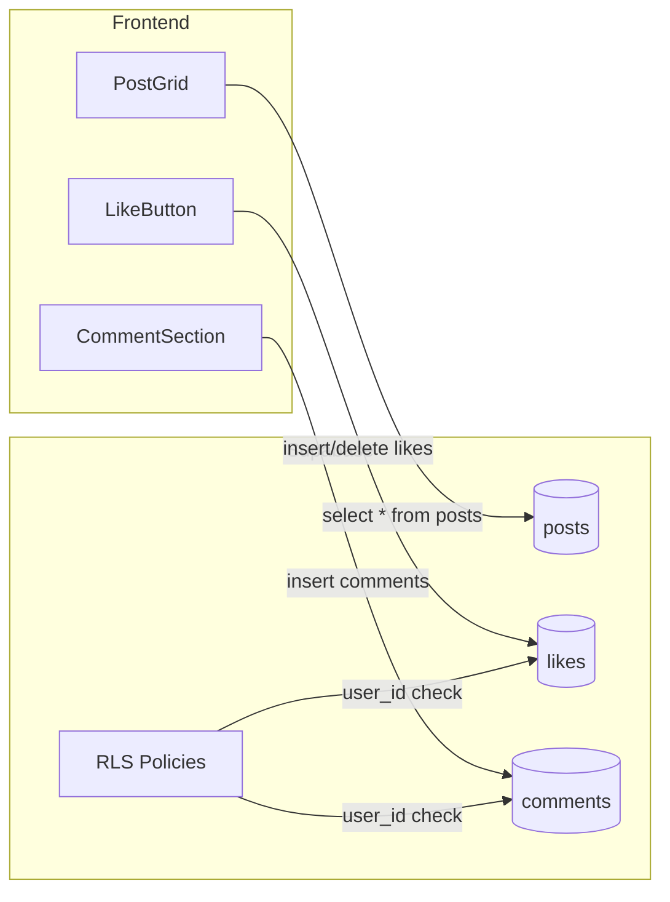

# 프론트엔드 MVP 완성 계획

## 현재 상태 분석

**구현 완료:**

- 대시보드 ([`dashboard/page.tsx`](frontend/src/app/[locale]/\\\\(dashboard)/dashboard/page.tsx)): Job 목록, 통계 카드
- Job 생성 위자드 ([`job-creation-wizard.tsx`](frontend/src/components/jobs/job-creation-wizard.tsx)): 4단계 플로우
- 에디터 ([`editor/page-content.tsx`](frontend/src/app/[locale]/\\\\(dashboard)/jobs/[id]/editor/page-content.tsx)): 자막 편집, 타임라인
- Supabase 클라이언트 ([`lib/supabase.ts`](frontend/src/lib/supabase.ts)): 헬퍼 함수 정의됨

**미구현/개선 필요:**

- 인증: Supabase Auth 미연동, 로그인 UI 없음
- 랜딩 페이지: 기본 Hero만 존재, 가격표/데모 없음
- 커뮤니티: Mock 데이터만 사용 ([`community/page.tsx`](frontend/src/app/[locale]/\\\\(dashboard)/community/page.tsx))

---

## Phase 1: 인증 시스템 (Authentication)

### 1.1 Supabase Auth Provider 설정

```
src/
├── components/
│   └── providers/
│       └── auth-provider.tsx    # 신규: 인증 컨텍스트
├── hooks/
│   └── use-auth.ts              # 신규: 인증 훅
└── lib/
    └── supabase.ts              # 수정: auth 헬퍼 추가
```

- `AuthProvider`로 앱 전체를 감싸 세션 상태 관리
- `useAuth()` 훅: `user`, `session`, `signIn`, `signOut`, `loading` 제공
- 자동 토큰 갱신 및 세션 복원 처리

### 1.2 로그인/회원가입 페이지

```
src/app/[locale]/
├── (auth)/
│   ├── layout.tsx               # 인증 페이지 공통 레이아웃
│   ├── login/
│   │   └── page.tsx             # 로그인 (이메일 + OAuth)
│   └── signup/
│       └── page.tsx             # 회원가입
```

- OAuth 지원: Google, GitHub (Supabase 대시보드에서 설정)
- Magic Link 이메일 로그인 옵션
- 폼 유효성 검사 (react-hook-form + zod)
- 에러 토스트 메시지 (sonner)

### 1.3 보호된 라우트 및 미들웨어

- [`middleware.ts`](frontend/src/middleware.ts) 수정: 인증 필요 경로 체크
- `/dashboard`, `/jobs/*`, `/community/create` 등 보호
- 미인증 시 `/login?redirect=...`로 리다이렉트

### 1.4 Navbar 사용자 정보 표시

- [`navbar.tsx`](frontend/src/components/layout/navbar.tsx) 수정
- 로그인 상태: 아바타, 크레딧 잔액, 드롭다운 메뉴
- 비로그인 상태: 로그인/회원가입 버튼

---

## Phase 2: 랜딩 페이지 (Marketing)

### 2.1 페이지 구조

```
src/app/[locale]/
├── page.tsx                     # 랜딩 페이지 (리팩토링)
├── pricing/
│   └── page.tsx                 # 가격 정책 페이지
```

### 2.2 랜딩 페이지 섹션

| 섹션 | 설명 |

|------|------|

| Hero | 메인 카피 + CTA 버튼 + 영상 데모 임베드 |

| How It Works | 3단계 프로세스 시각화 (업로드 → AI 처리 → 공유) |

| Features | 핵심 기능 그리드 (음원 분리, 다국어 자막, 싱크 편집) |

| Demo Video | 실제 생성 결과 예시 또는 스크린 녹화 |

| Pricing | 플랜 비교 카드 (Free / Pro / Enterprise) |

| Testimonials | 사용자 후기 (선택적) |

| CTA | 최종 가입 유도 섹션 |

| Footer | 링크, 소셜 미디어, 법적 고지 |

### 2.3 가격 페이지 (`/pricing`)

- Supabase `plans` 테이블 데이터 기반 렌더링
- 플랜별 기능 비교 테이블
- Stripe Checkout 연동 준비 (버튼만, 실제 결제는 Phase 3)

---

## Phase 3: 커뮤니티 기능 (Community)

### 3.1 컴포넌트 구조

```
src/components/community/
├── post-card.tsx                # 포스트 카드 (썸네일, 좋아요, 조회수)
├── post-grid.tsx                # 포스트 그리드 레이아웃
├── post-detail-modal.tsx        # 포스트 상세 모달 (영상 재생)
├── comment-section.tsx          # 댓글 섹션
├── comment-item.tsx             # 개별 댓글 (대댓글 지원)
├── like-button.tsx              # 좋아요 버튼 (낙관적 업데이트)
└── share-post-dialog.tsx        # 내 작업 공유 다이얼로그
```

### 3.2 페이지 구조

```
src/app/[locale]/(dashboard)/community/
├── page.tsx                     # 커뮤니티 피드 (리팩토링)
└── [postId]/
    └── page.tsx                 # 포스트 상세 페이지
```

### 3.3 핵심 기능

- **피드**: 최신순/인기순/추천순 정렬, 무한 스크롤
- **좋아요**: 낙관적 업데이트 + Supabase RLS
- **댓글**: 대댓글 지원, 실시간 업데이트 (Realtime)
- **공유**: Job 완료 후 "커뮤니티에 공유" 버튼
- **검색**: 태그 기반 필터링, 시맨틱 검색 (기존 함수 활용)

### 3.4 데이터 흐름



---

## 파일 변경 요약

| 작업 | 파일 | 유형 |

|------|------|------|

| Auth Provider | `components/providers/auth-provider.tsx` | 신규 |

| useAuth 훅 | `hooks/use-auth.ts` | 신규 |

| 로그인 페이지 | `app/[locale]/(auth)/login/page.tsx` | 신규 |

| 회원가입 페이지 | `app/[locale]/(auth)/signup/page.tsx` | 신규 |

| 인증 레이아웃 | `app/[locale]/(auth)/layout.tsx` | 신규 |

| 미들웨어 | `middleware.ts` | 수정 |

| Navbar | `components/layout/navbar.tsx` | 수정 |

| 랜딩 페이지 | `app/[locale]/page.tsx` | 수정 |

| 가격 페이지 | `app/[locale]/pricing/page.tsx` | 신규 |

| 커뮤니티 피드 | `app/[locale]/(dashboard)/community/page.tsx` | 수정 |

| 포스트 상세 | `app/[locale]/(dashboard)/community/[postId]/page.tsx` | 신규 |

| 커뮤니티 컴포넌트 | `components/community/*.tsx` | 신규 (6개) |

---

## 기술 스택 및 라이브러리

- **인증**: Supabase Auth (OAuth, Magic Link)
- **상태 관리**: Zustand (기존) + React Query (서버 상태)
- **폼**: react-hook-form + zod
- **UI**: shadcn/ui (기존)
- **애니메이션**: framer-motion (랜딩 페이지)
- **아이콘**: lucide-react (기존)

---

## 의존성 추가 필요

```bash
pnpm add @tanstack/react-query framer-motion
```