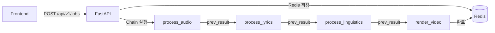

# 한 사이클 완성을 위한 버그 수정 계획

## 현재 상태 요약



## 수정이 필요한 핵심 버그

### 1. lyrics 데이터 구조 불일치 (Critical)

**문제:** Mock 모드에서 `process_lyrics`가 list를 반환하지만, `process_linguistics`는 dict 구조를 기대함

```python
# tasks.py:137-141 - 현재 mock 반환 (list)
result = [
    {"start": 0, "end": 5, "text": "This is a mock lyric line 1"},
]

# tasks.py:163 - linguistics에서 dict 구조 기대
lyrics_segments = prev_result.get("lyrics", {}).get("segments", [])
# → mock일 때 빈 배열이 됨!
```

**수정:** [backend/app/worker/tasks.py](backend/app/worker/tasks.py) - mock 데이터 구조를 dict로 통일

```python
result = {
    "segments": [
        {"start": 0, "end": 5, "text": "...", "words": [...]},
    ],
    "language": "ja"
}
```

---

### 2. Mock lyrics에 words 필드 누락 (High)

**문제:** 자막 생성기(`subtitle_generator.py`)가 word-level 타임스탬프를 기대함

```python
# subtitle_generator.py:38-52
words = seg.get("words", [])
if words:
    for word in words:
        # karaoke 효과 생성
```

**수정:** [backend/app/worker/tasks.py](backend/app/worker/tasks.py) - mock에 words 필드 추가

---

### 3. process_audio mock 경로 문제 (Medium)

**문제:** Mock 모드에서도 `convert_to_wav`를 건너뛰어야 하는데, 분기가 불완전

```python
# tasks.py:97-98
if not use_mock:
    file_path = convert_to_wav(file_path)
```

현재 코드는 맞지만, mock에서 반환하는 경로가 `.m4a`인데 FFmpeg 렌더링에서 문제가 될 수 있음.

**확인 필요:** synthesis.py에서 instrumental 파일을 그대로 사용하는지 검토

---

## 수정 계획

### Step 1: tasks.py mock 데이터 구조 수정

`process_lyrics` 함수의 mock 반환값을 실제 WhisperX 출력 구조와 동일하게 변경:

```python
result = {
    "segments": [
        {
            "start": 0.0,
            "end": 3.5,
            "text": "踊り子の夜が始まる",
            "words": [
                {"word": "踊り子", "start": 0.0, "end": 1.2},
                {"word": "の", "start": 1.2, "end": 1.4},
                {"word": "夜", "start": 1.4, "end": 2.0},
                {"word": "が", "start": 2.0, "end": 2.2},
                {"word": "始まる", "start": 2.2, "end": 3.5},
            ]
        },
        # 2-3개 더 추가
    ],
    "language": "ja"
}
```

### Step 2: process_linguistics mock 분기 수정

Mock일 때 segments 접근 로직이 두 가지 케이스를 처리하려다 복잡해졌으므로 정리:

```python
# 통일된 접근
lyrics_data = prev_result.get("lyrics", {})
if isinstance(lyrics_data, dict):
    lyrics_segments = lyrics_data.get("segments", [])
else:
    lyrics_segments = lyrics_data  # fallback
```

### Step 3: 하드코딩 경로 상대경로로 개선 (선택)

현재 XXX 주석이 달린 절대 경로를 프로젝트 기준 상대 경로로 변경:

```python
# 현재
default_resource = "/home/cycle1223/workspace/karaoke-generator/backend/resource/odoriko.m4a"

# 개선
import pathlib
default_resource = pathlib.Path(__file__).parent.parent.parent / "resource" / "odoriko.m4a"
```

---

## 테스트 체크리스트

한 사이클 성공 확인을 위한 검증 항목:

- [ ] Redis 실행 중
- [ ] Celery worker 실행 중
- [ ] 프론트에서 생성 요청 → job_id 반환
- [ ] Redis에서 job 상태 PENDING → PROCESSING → COMPLETED 확인
- [ ] `/tmp/karaoke-gen/` 에 출력 파일 생성 확인
- [ ] 출력 영상에 자막(ASS) 포함 확인