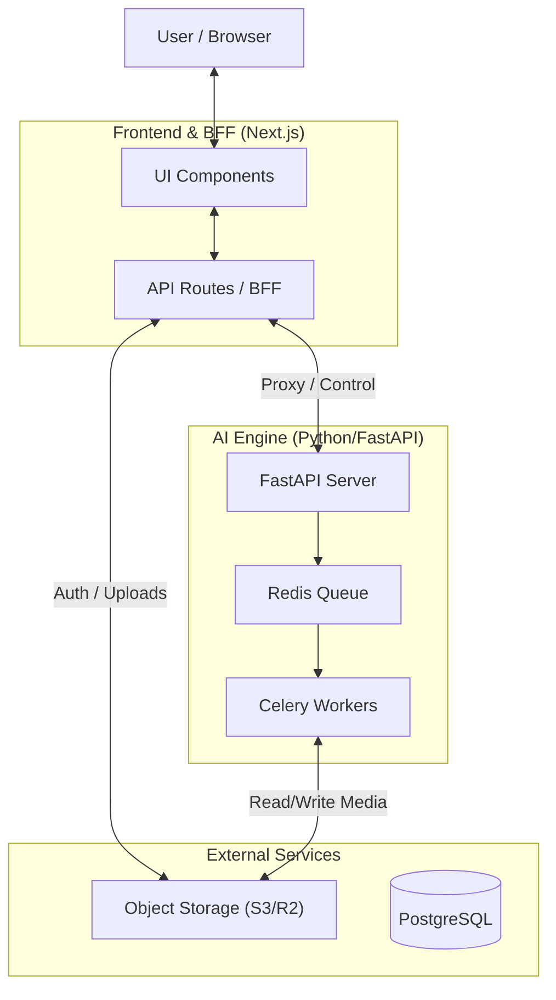

# AI-Powered Multilingual Karaoke Generator

This project creates high-quality karaoke videos from any song using AI source separation and lyrics alignment.

## 🏗 System Architecture

We adopt a **Hybrid Architecture** combining Next.js (BFF) and FastAPI (AI Engine).



### 1. Frontend & BFF (Next.js)
Located in `/frontend`. Handles user interaction and lightweight backend tasks.
- **Port:** 3000
- **Responsibilities:**
  - **UI/UX:** React-based interface for job creation and video editing.
  - **Auth:** Session management and authentication (Auth Proxy).
  - **Gateway:** Reverse proxy to hide the Python backend.
  - **Uploads:** Generating pre-signed URLs for direct S3 uploads.

### 2. AI Engine (FastAPI + Celery)
Located in `/backend`. Handles heavy computation and AI processing.
- **Port:** 8000
- **Responsibilities:**
  - **Source Separation:** Demucs (Vocals vs Instrumental).
  - **Lyrics Sync:** WhisperX (Phoneme-level alignment).
  - **Rendering:** FFmpeg (Video synthesis).
  - **Queueing:** Managing long-running jobs via Redis.

---

## 📂 Project Structure

- **`frontend/`**: Next.js App Router application.
  - `src/app/api/`: BFF endpoints (Auth, Proxy, Uploads).
  - `src/components/`: Reusable UI components.
- **`backend/`**: Python FastAPI application.
  - `app/api/`: Internal control endpoints.
  - `app/worker/`: Celery tasks for AI processing.
  - `app/services/`: Core logic (Audio, STT, Video).

## 🚀 Getting Started

### Prerequisites
- Docker & Docker Compose
- Node.js 18+
- Python 3.10+

### Run Everything
```bash
docker-compose up --build
```
