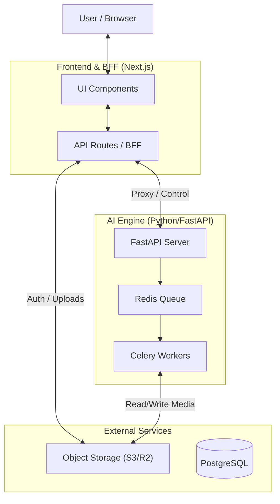

# AI-Powered Multilingual Karaoke Generator

This project creates high-quality karaoke videos from any song using AI source separation and lyrics alignment.

## 🏗 System Architecture

We adopt a **Hybrid Architecture** combining Next.js (BFF) and FastAPI (AI Engine).



### 1. Frontend & BFF (Next.js)
Located in `/frontend`. Handles user interaction and lightweight backend tasks.
- **Port:** 3000
- **Responsibilities:**
  - **UI/UX:** React-based interface for job creation and video editing.
  - **Auth:** Session management and authentication (Auth Proxy).
  - **Gateway:** Reverse proxy to hide the Python backend.
  - **Uploads:** Generating pre-signed URLs for direct S3 uploads.

### 2. AI Engine (FastAPI + Celery)
Located in `/backend`. Handles heavy computation and AI processing.
- **Port:** 8000
- **Responsibilities:**
  - **Source Separation:** Demucs (Vocals vs Instrumental).
  - **Lyrics Sync:** WhisperX (Phoneme-level alignment).
  - **Rendering:** FFmpeg (Video synthesis).
  - **Queueing:** Managing long-running jobs via Redis.

---

## 📂 Project Structure

- **`frontend/`**: Next.js App Router application.
  - `src/app/api/`: BFF endpoints (Auth, Proxy, Uploads).
  - `src/components/`: Reusable UI components.
- **`backend/`**: Python FastAPI application.
  - `app/api/`: Internal control endpoints.
  - `app/worker/`: Celery tasks for AI processing.
  - `app/services/`: Core logic (Audio, STT, Video).

## 🚀 실행 방법 (Getting Started)

### 사전 요구사항 (Prerequisites)
- Docker & Docker Compose (권장)
- Node.js 20+ (pnpm 권장) - 수동 실행 시
- Python 3.10+ - 수동 실행 시
- Redis Server - 수동 실행 시

### 1. 전체 실행 (Docker Compose) - 권장
가장 간편하게 모든 서비스를 실행하는 방법입니다. 터미널 하나로 충분합니다.

```bash
# 1) 환경변수 설정 (최초 1회)
cp backend/env.sample backend/.env
cp frontend/env.sample frontend/.env.local
# .env 파일을 열어 GEMINI_API_KEY 등 필요한 값을 설정하세요

# 2) 모든 서비스 실행 (빌드 포함)
docker-compose up --build

# 백그라운드 실행
docker-compose up -d --build

# 로그 확인
docker-compose logs -f

# 종료
docker-compose down
```

**실행되는 서비스:**
- **Redis** (6379): 작업 큐 및 캐시
- **API** (8000): FastAPI 백엔드
- **Worker**: Celery 백그라운드 워커
- **Frontend** (3000): Next.js 개발 서버

### 2. 수동 실행 (Manual Setup)
개발 및 디버깅을 위해 각 서비스를 개별적으로 실행하는 방법입니다. 총 4개의 터미널이 필요합니다.

#### Step 1: Redis 실행 (메시지 큐)
백엔드와 워커 간의 통신을 위해 Redis가 실행 중이어야 합니다.
```bash
redis-server
```

#### Step 2: 백엔드 API 서버 실행
FastAPI 서버를 8000번 포트에서 실행합니다.
```bash
cd backend
# 가상환경 생성 및 활성화 (선택사항)
# python -m venv venv
# source venv/bin/activate

# 의존성 설치
pip install -r requirements.txt

# 서버 실행
uvicorn app.main:app --reload --port 8000
```

#### Step 3: Celery 워커 실행
실제 AI 작업을 처리하는 백그라운드 워커를 실행합니다.
```bash
cd backend
# 백엔드와 동일한 환경에서 실행
celery -A app.worker.celery_app worker --loglevel=info
```

#### Step 4: 프론트엔드 실행
Next.js 개발 서버를 3000번 포트에서 실행합니다.
```bash
cd frontend
pnpm install
pnpm dev
```

이제 브라우저에서 `http://localhost:3000`으로 접속하여 서비스를 이용할 수 있습니다.
