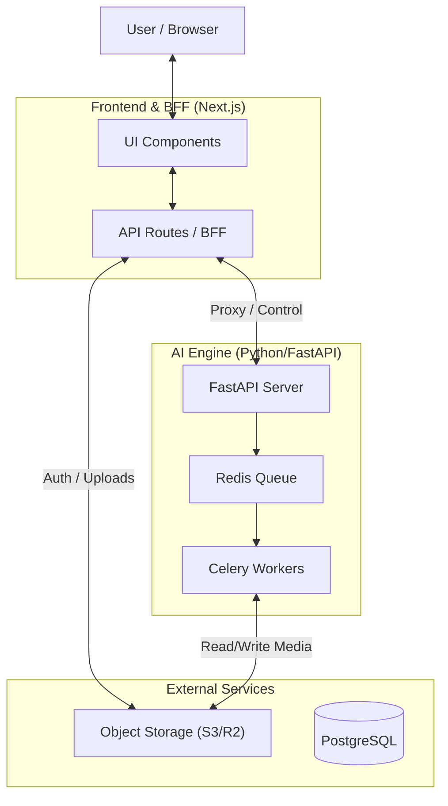

# AI-Powered Multilingual Karaoke Generator

This project creates high-quality karaoke videos from any song using AI source separation and lyrics alignment.

## 🏗 System Architecture

We adopt a **Hybrid Architecture** combining Next.js (BFF) and FastAPI (AI Engine).



### 1. Frontend & BFF (Next.js)
Located in `/frontend`. Handles user interaction and lightweight backend tasks.
- **Port:** 3000
- **Responsibilities:**
  - **UI/UX:** React-based interface for job creation and video editing.
  - **Auth:** Session management and authentication (Auth Proxy).
  - **Gateway:** Reverse proxy to hide the Python backend.
  - **Uploads:** Generating pre-signed URLs for direct S3 uploads.

### 2. AI Engine (FastAPI + Celery)
Located in `/backend`. Handles heavy computation and AI processing.
- **Port:** 8000
- **Responsibilities:**
  - **Source Separation:** Demucs (Vocals vs Instrumental).
  - **Lyrics Sync:** WhisperX (Phoneme-level alignment).
  - **Rendering:** FFmpeg (Video synthesis).
  - **Queueing:** Managing long-running jobs via Redis.

---

## 📂 Project Structure

- **`frontend/`**: Next.js App Router application.
  - `src/app/api/`: BFF endpoints (Auth, Proxy, Uploads).
  - `src/components/`: Reusable UI components.
- **`backend/`**: Python FastAPI application.
  - `app/api/`: Internal control endpoints.
  - `app/worker/`: Celery tasks for AI processing.
  - `app/services/`: Core logic (Audio, STT, Video).

## 🚀 실행 방법 (Getting Started)

### 사전 요구사항 (Prerequisites)
- Docker & Docker Compose (권장)
- Node.js 20+ (pnpm 권장) - 수동 실행 시
- Python 3.10+ - 수동 실행 시
- Redis Server - 수동 실행 시

### 1. 전체 실행 (Docker Compose) - 권장
가장 간편하게 모든 서비스를 실행하는 방법입니다. 터미널 하나로 충분합니다.

```bash
# 1) 환경변수 설정 (최초 1회)
cp backend/env.sample backend/.env
cp frontend/env.sample frontend/.env.local
# .env 파일을 열어 GEMINI_API_KEY 등 필요한 값을 설정하세요

# 2) Supabase 설정 (아래 "Supabase 개발 환경 설정" 섹션 참고)

# 3) 모든 서비스 실행 (빌드 포함)
docker-compose up --build

# 백그라운드 실행
docker-compose up -d --build

# 로그 확인
docker-compose logs -f

# 종료
docker-compose down
```

**실행되는 서비스:**
- **Redis** (6379): 작업 큐 및 캐시
- **API** (8000): FastAPI 백엔드
- **Worker**: Celery 백그라운드 워커
- **Frontend** (3000): Next.js 개발 서버

### Supabase 개발 환경 설정

이 프로젝트는 Supabase를 데이터베이스, 인증, 스토리지로 사용합니다. 개발 환경을 설정하려면 다음 단계를 따르세요.

#### 1. Supabase 프로젝트 생성

1. [Supabase Dashboard](https://app.supabase.com)에 접속하여 새 프로젝트 생성
2. 프로젝트 설정에서 다음 정보 확인:
   - **Project URL**: `https://xxxxx.supabase.co`
   - **Project Reference ID**: 프로젝트 URL의 서브도메인 부분
   - **API Keys**: Settings → API에서 확인
     - `anon` (Publishable Key): 클라이언트용, 공개 가능
     - `service_role` (Secret Key): 서버 전용, 절대 공개 금지

#### 2. 환경변수 설정

**백엔드 (`backend/.env`):**
```bash
# Supabase 설정
SUPABASE_URL=https://xxxxx.supabase.co
SUPABASE_PUBLISHABLE_KEY=eyJhbGciOiJIUzI1NiIsInR5cCI6IkpXVCJ9...  # anon key
SUPABASE_SECRET_KEY=eyJhbGciOiJIUzI1NiIsInR5cCI6IkpXVCJ9...      # service_role key
```

**프론트엔드 (`frontend/.env.local`):**
```bash
# Supabase 설정
NEXT_PUBLIC_SUPABASE_URL=https://xxxxx.supabase.co
NEXT_PUBLIC_SUPABASE_PUBLISHABLE_KEY=eyJhbGciOiJIUzI1NiIsInR5cCI6IkpXVCJ9...  # anon key
```

#### 3. Supabase CLI 설치 (선택사항)

로컬에서 마이그레이션을 실행하거나 Edge Functions를 배포하려면 Supabase CLI가 필요합니다.

```bash
# 자동 설치 스크립트 사용 (Linux)
cd backend/supabase
chmod +x install-cli.sh
./install-cli.sh

# 또는 공식 문서 참고: https://supabase.com/docs/guides/cli
```

#### 4. 데이터베이스 마이그레이션 실행

프로젝트에 포함된 마이그레이션 파일을 Supabase에 적용합니다.

**방법 1: 자동 연결 (권장)**

`.env` 파일의 `SUPABASE_URL`을 자동으로 읽어서 프로젝트를 연결합니다.

```bash
cd backend/supabase

# Supabase CLI 로그인 (최초 1회)
supabase login

# .env 파일의 SUPABASE_URL을 읽어서 자동 연결
./link-project.sh

# 마이그레이션 실행
supabase db push
```

**방법 2: 수동 연결**

Project Reference ID를 직접 입력하여 연결합니다.

```bash
cd backend/supabase

# Supabase CLI 로그인
supabase login

# 프로젝트 연결 (YOUR_PROJECT_REF는 .env의 SUPABASE_URL에서 추출)
supabase link --project-ref YOUR_PROJECT_REF

# 마이그레이션 실행
supabase db push
```

**Project Reference ID 찾는 방법:**
- `.env` 파일의 `SUPABASE_URL=https://xxxxx.supabase.co`에서 `xxxxx` 부분이 Reference ID입니다.
- 또는 Supabase Dashboard → Settings → General에서 확인 가능합니다.

또는 Supabase Dashboard에서 직접 SQL을 실행할 수도 있습니다:
1. Dashboard → SQL Editor로 이동
2. `backend/supabase/migrations/` 폴더의 SQL 파일들을 순서대로 실행

**마이그레이션 파일 목록:**
- `00001_extensions.sql`: PostgreSQL 확장 설치
- `00002_enums.sql`: 열거형 타입 정의
- `00003_profiles.sql`: 사용자 프로필 테이블
- `00004_jobs.sql`: 작업(Job) 테이블
- `00005_billing.sql`: 결제 관련 테이블
- `00006_posts_variants.sql`: 게시물 및 변형 테이블
- `00007_community.sql`: 커뮤니티 기능 테이블
- `00008_notifications.sql`: 알림 테이블
- `00009_credit_system.sql`: 크레딧 시스템
- `00010_rls_policies.sql`: Row Level Security 정책
- `00011_recommendation_functions.sql`: 추천 함수
- `00012_additional_indexes.sql`: 추가 인덱스
- `00013_realtime_config.sql`: 실시간 기능 설정
- `00014_storage_setup.sql`: 스토리지 버킷 설정

#### 5. Edge Functions 배포 (선택사항)

프로젝트에 포함된 Edge Functions를 배포합니다.

```bash
cd backend/supabase

# 모든 함수 배포
supabase functions deploy

# 특정 함수만 배포
supabase functions deploy generate-embedding
supabase functions deploy get-video-url
supabase functions deploy stripe-webhook
```

**Edge Functions 목록:**
- `generate-embedding`: 텍스트 임베딩 생성
- `get-video-url`: 비디오 URL 생성 (서명된 URL)
- `stripe-webhook`: Stripe 결제 웹훅 처리

#### 6. 스토리지 버킷 확인

마이그레이션 실행 시 자동으로 생성되지만, Dashboard에서 확인하세요:
1. Dashboard → Storage로 이동
2. 다음 버킷들이 생성되어 있는지 확인:
   - `audio-files`: 오디오 파일 저장
   - `video-files`: 비디오 파일 저장
   - `thumbnails`: 썸네일 이미지 저장

#### 문제 해결

- **RLS 정책 오류**: `00010_rls_policies.sql`이 제대로 실행되었는지 확인
- **스토리지 접근 오류**: `00014_storage_setup.sql`의 버킷 설정 확인
- **인증 오류**: 환경변수의 API 키가 올바른지 확인 (Publishable Key vs Secret Key)

자세한 내용은 `backend/supabase/MIGRATION_GUIDE.md`를 참고하세요.

### 2. 수동 실행 (Manual Setup)
개발 및 디버깅을 위해 각 서비스를 개별적으로 실행하는 방법입니다. 총 4개의 터미널이 필요합니다.

#### Step 1: Redis 실행 (메시지 큐)
백엔드와 워커 간의 통신을 위해 Redis가 실행 중이어야 합니다.
```bash
redis-server
```

#### Step 2: 백엔드 API 서버 실행
FastAPI 서버를 8000번 포트에서 실행합니다.
```bash
cd backend
# 가상환경 생성 및 활성화 (선택사항)
# python -m venv venv
# source venv/bin/activate

# 의존성 설치
pip install -r requirements.txt

# 서버 실행
uvicorn app.main:app --reload --port 8000
```

#### Step 3: Celery 워커 실행
실제 AI 작업을 처리하는 백그라운드 워커를 실행합니다.
```bash
cd backend
# 백엔드와 동일한 환경에서 실행
celery -A app.worker.celery_app worker --loglevel=info
```

#### Step 4: 프론트엔드 실행
Next.js 개발 서버를 3000번 포트에서 실행합니다.
```bash
cd frontend
pnpm install
pnpm dev
```

이제 브라우저에서 `http://localhost:3000`으로 접속하여 서비스를 이용할 수 있습니다.
